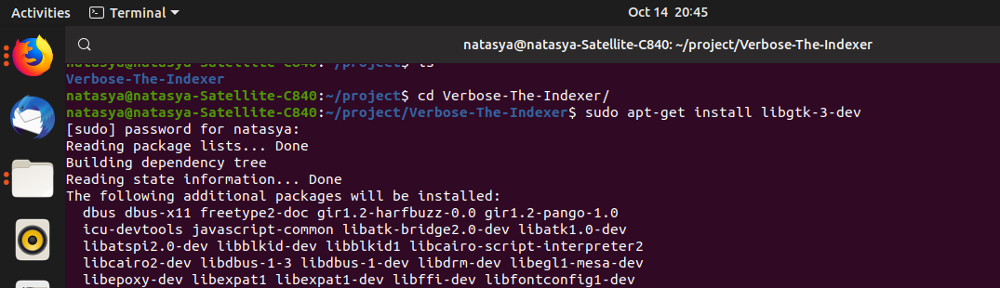
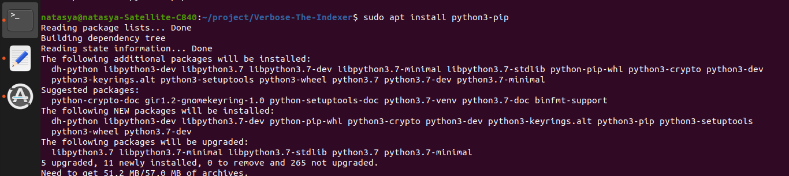
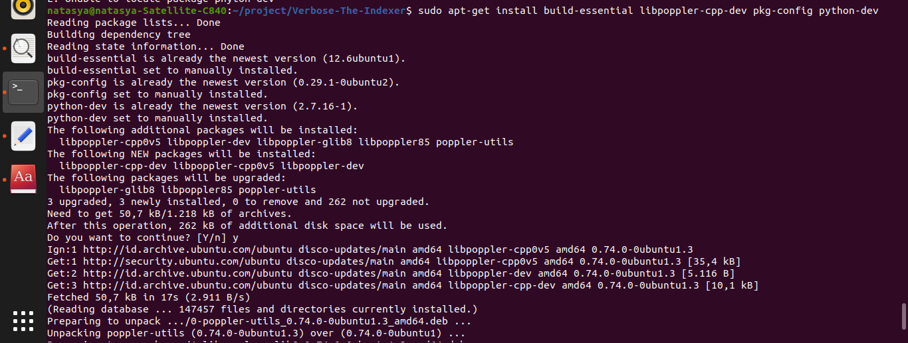
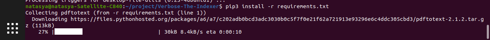
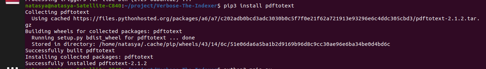
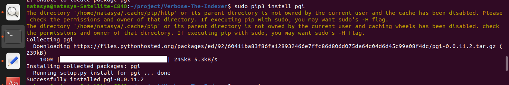
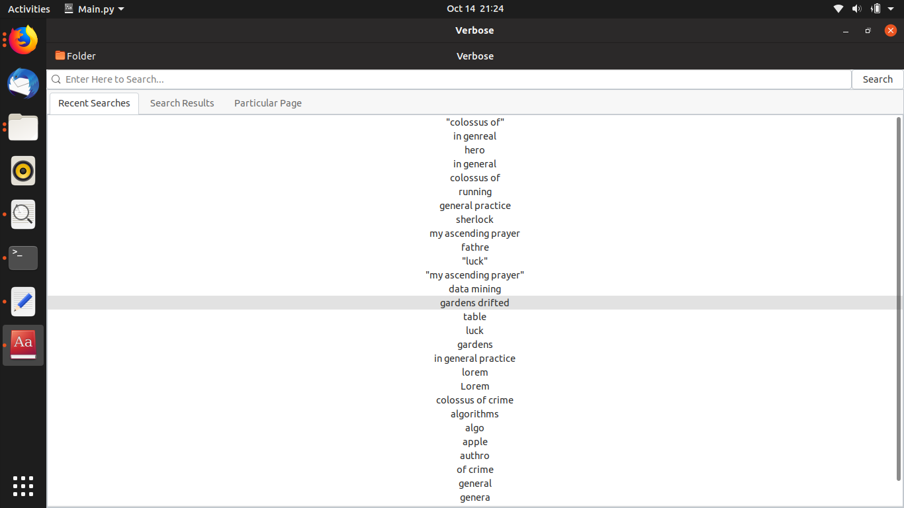
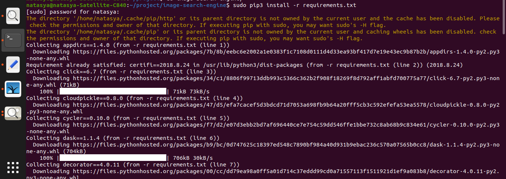
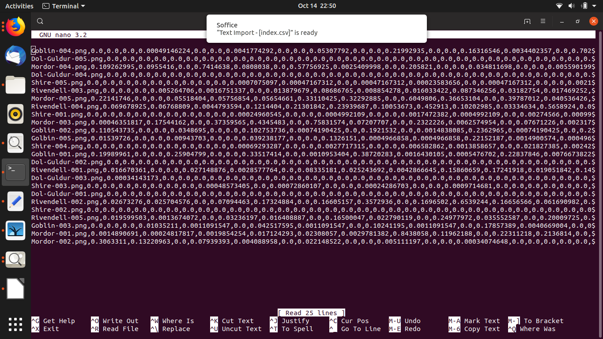

# Program untuk indexing text dan image 

## Indexing Text 
### *Requirements :
1. ```sudo apt-get install libgtk-3-dev```

2. ```sudo apt install python3-pip```

3. ```sudo apt-get install build-essential libpoppler-cpp-dev pkg-config python-dev```


### *Cara menjalankan : 
1. ```cd indexText```
2. ```pip3 install -r requirements.txt```

3. ```pip3 install pdftotext```

4. ```pip3 install pgi```

5. ```python3 main.py```

6. Output


## Indexing Image
### *Cara menjalankan : 
1. ```cd indexImage```
2. ```sudo pip3 install -r requirements.txt```

3. ```cd app```
4. ```python3 index.py --dataset static/images --index index.csv```

5. Output



## Sumber :
* Text-Indexing: Swish-e (Package on Ubuntu)
* Image-Indexing: https://github.com/kudeh/image-search-engine.
